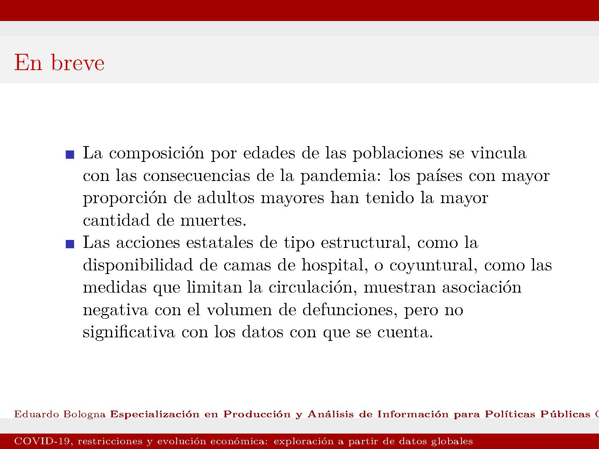

---
authors:
- admin
categories: []
date: "2020-07-16"
summary: Diapos sobre la relación entre cuarentena, muertes atribuídas a COVID-19 y evolución proyectada del PBI
tags:
- COVID-19
- Impacto económico cuarentena
title: COVID-19 restricciones gubernamentales y evolución proyectada del PBI
---

---

---

---

---

---

---

---

---

---

---

---

---

---

---

---

---

---

---

---

