# Introducción  

Esta entrada apunta a ofrecer un repertorio inicial de técnicas de visualización por medio del paquete *ggplot2*, mostrando aplicaciones para representar gráficamente variables de distinto tipo. Para los ejemplos usamos datos abiertos, publicados por el Institute Nacional de Estadística y Censos de Argentina.  

Una sugerencia para quienes no tengan experiencia en el uso de este paquete, es que se ensayen los procedimientos, con estos datos o con otros, para reproducir los gráficos. Además, gracias a la gran comunidad de usuarios de *R* y de *ggplot2*, todo lo que no esté claro de este documento se puede buscar en la web, en particular https://stackoverflow.com y su versión en español https://es.stackoverflow.com/, son muy recomendables, así como la ayuda que provee *R* sobre los comandos, colocando un signo de pregunta antes del comando.   


# Lectura de la base  

Vamos a usar la base de microdatos del segundo trimestre de 2020 de la Encuesta Permanente de Hogares de Argentina, que se obtiene comprimida en formato *.txt* en [este](https://www.indec.gob.ar/ftp/cuadros/menusuperior/eph/EPH_usu_2_Trim_2020_txt.zip) link. Los dos archivos que se obtienen contienen la base de hogares y la de personas, usaremos esta última.    


```r
eph_2_20<-read.csv("usu_Individual_T220.txt", sep=";", dec = ",")
```

Para conocer las variables que releva esta encuesta, sus nombres y los códigos de sus categorías, se usa el documento [Diseño de registros y estructura de las bases de microdatos](https://www.indec.gob.ar/ftp/cuadros/menusuperior/eph/EPH_registro_2T2020.pdf). En lo que sigue, de esta base solo se usarán las variables:  relación de parentesco con el jefe de hogar (CH03), sexo (CH04), edad (CH06), nivel de educación (NIVEL_ED), ingresos totales individuales (P47T) y región (REGION).  


# Inspección de las variables seleccionadas  
Empezamos solicitando una descripción básica de las variables para observar su comportamiento:  

```r
attach(eph_2_20)
table(CH04)
```

```
## CH04
##     1     2 
## 17792 19340
```

```r
summary(CH06)
```

```
##    Min. 1st Qu.  Median    Mean 3rd Qu.    Max. 
##   -1.00   17.00   33.00   35.27   52.00  102.00
```

```r
table(NIVEL_ED)
```

```
## NIVEL_ED
##    1    2    3    4    5    6    7 
## 5318 4640 7840 7102 4493 4730 3009
```

```r
summary(P47T)
```

```
##    Min. 1st Qu.  Median    Mean 3rd Qu.    Max.    NA's 
##      -9       0    3000   13957   20800 2030000      65
```

```r
table(REGION)
```

```
## REGION
##     1    40    41    42    43    44 
##  3935  8725  3971  5158 11442  3901
```

```r
detach(eph_2_20)
```

# Codificación y otros ajustes  
Las modificaciones necesarias para trabajar con comodidad con las variables, incluyen darles un nombre para identificarlas fácilmente y, según cada una algún otro ajuste:  

## sexo:  
Tratar a la variable como categórica (*factor*), darle nombre y etiquetar sus categorías  

```r
eph_2_20$sexo<-as.factor(eph_2_20$CH04)
levels(eph_2_20$sexo)<- c("varones", "mujeres")
```

## edad  
Rotular y reemplazar el símbolo *-1*, que el INDEC usa para indicar a los menores de un año, por el valor cero  

```r
eph_2_20$edad<-eph_2_20$CH06
eph_2_20$edad[eph_2_20$edad==-1]<-0
```

## educación  
Rotularla, cambiar el código *7*, asignado a "nunca asistió", por el valor cero, a fin de respetar el orden de las categorías, y luego etiquetarlas.  


```r
eph_2_20$educacion<-eph_2_20$NIVEL_ED
eph_2_20$educacion[eph_2_20$educacion==7]<-0
eph_2_20$educacion<-as.factor(eph_2_20$educacion)
levels(eph_2_20$educacion)<-c("nunca asistió", "primaria incompleta", "primaria completa",
                               "secundaria incompleta",  "secundaria completa",
                              "superior incompleto", "superior completo")
```

## ingresos totales individuales  
Eliminar los ceros y los códigos *-9* para conservar solo personas con ingresos no nulos declarados  


```r
eph_2_20$ingresos<-eph_2_20$P47T
eph_2_20$ingresos[eph_2_20$ingresos==0 | eph_2_20$ingresos==-9]<-NA
summary(eph_2_20$ingresos)
```

```
##    Min. 1st Qu.  Median    Mean 3rd Qu.    Max.    NA's 
##     180   14000   20000   27073   34000 2030000   18022
```

## región  
Tratarla como factor y etiquetar las categorías, conservamos el nombre original  

```r
eph_2_20$REGION<-as.factor(eph_2_20$REGION)
levels(eph_2_20$REGION)<-c("Gran Buenos Aires", "NOA", "NEA", "Cuyo",
                           "Pampeana", "Patagónica")
```


Para verificar que los cambios sean correctos, se pueden pedir las descripciones de las nuevas variables, inclusive pueden pedirse distribuciones bivariadas de la variable original cruzada con la nueva, a fin de detectar incostitencias. Esto no es válido para la variable *ingresos*, a la cual se puede correlacionar con la original, a efectos de verificación.    

# Representaciones gráficas  

En el entorno de *R*, *ggplot2* es la biblioteca más usada para graficar, debido a su versatilidad y lo intuitivo de los comandos. El paquete *ggplot2* debe ser instalado por única vez  


```r
install.packages("ggplot2")
```

Y luego cargado en cada sesión  

```r
library(ggplot2)
```

# Variables categóricas  

## Gráfico de barras  
El más elemental de los gráficos es una barra para cada categoría de una variable dicotómica, como sexo. Empezamos con indicar el conjunto de datos de donde se obtendrán las variables a graficar.  

```r
ggplot(eph_2_20)
```

<!-- -->

Esta es la capa base, que no genera ningún gráfico. Ahora indicamos qué elemento geométrico usareos y qué variable(s) se representarán.  

```r
ggplot(eph_2_20)+geom_bar(aes(sexo))
```

<!-- -->

La expresión *aes(sexo)*, conocida como la "estética", indica la o las variables que se van a graficar. Se obtiene lo mismo si la estética se ubica dentro de la capa base.  


```r
ggplot(eph_2_20,aes(sexo))+geom_bar()
```

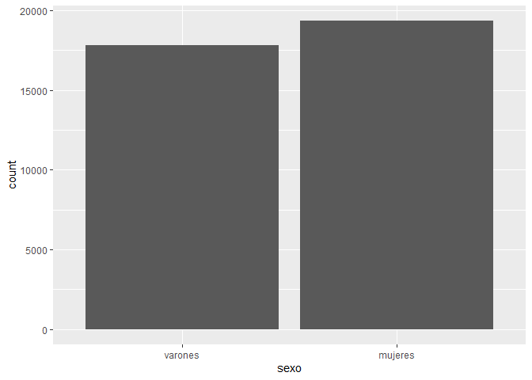<!-- -->

Esto último es conveniente si se van a sumar varias capas representado las mismas variables, y no lo es si diferentes capas taerán diferentes variables. En ese caso conviene que la estética esté dentro de cada capa.  
Si las categorías de sexo se mapean al color, debe incuirse también dentro de la estética.  

```r
ggplot(eph_2_20,aes(sexo, fill=sexo))+geom_bar()
```

<!-- -->


O también  

```r
ggplot(eph_2_20,aes(sexo))+geom_bar(aes(fill=sexo))
```

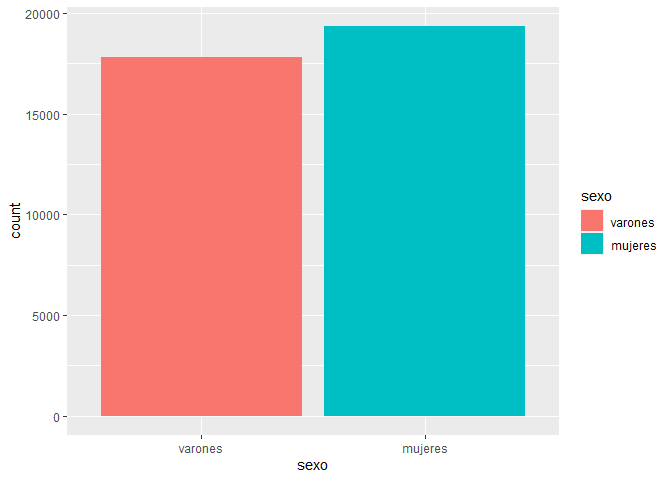<!-- -->


Los colores se pueden personalizar, con una capa de relleno manual  

```r
ggplot(eph_2_20,aes(sexo))+geom_bar(aes(fill=sexo))+
  scale_fill_manual(values=c("red", "green"))
```

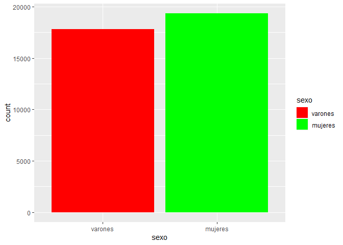<!-- -->

Un recordatorio con los nombres de los colores de la paleta por defecto puede hallarse [aquí](http://sape.inf.usi.ch/quick-reference/ggplot2/colour).  

La leyenda que indica los colores de cada sexo es superflua, conviene quitarla, con una capa que especifique que hacer con la o las leyenda(s).  

```r
ggplot(eph_2_20,aes(sexo))+geom_bar(aes(fill=sexo))+
  scale_fill_manual(values=c("red", "green"))+
  guides(fill=FALSE)
```

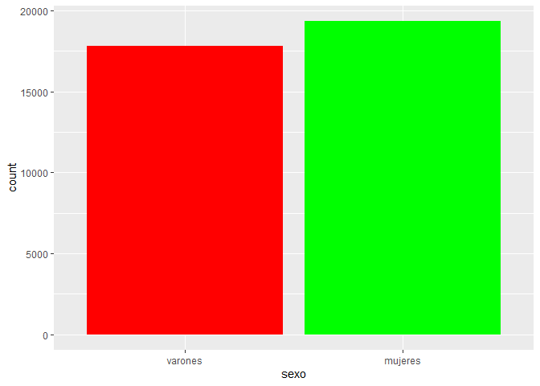<!-- -->

Esta última capa, permite seleccionar leyendas correspondientes a diferentes aspectos gráficos (tamaño, forma, color, etc), en este ejemplo se eligió la leyenda sobre el relleno.  

El gráfico anterior puede girarse 90 grados, con una capa de giro de coordenadas:  


```r
ggplot(eph_2_20,aes(sexo))+geom_bar(aes(fill=sexo))+
  scale_fill_manual(values=c("red", "green"))+
  guides(fill=FALSE)+coord_flip()
```

<!-- -->


## Dos variables categóricas    
Para observar la distribución conjunta de dos variables pueden combinarse, mapeándolas a diferentes aspectos gráficos. Por ejempo si se toman las categorías de educación en las barras y se mapea el sexo al color.  


```r
ggplot(eph_2_20)+geom_bar(aes(educacion, fill=sexo))+
  scale_fill_manual(values=c("red", "green"))+
  guides(fill=FALSE)+coord_flip()
```

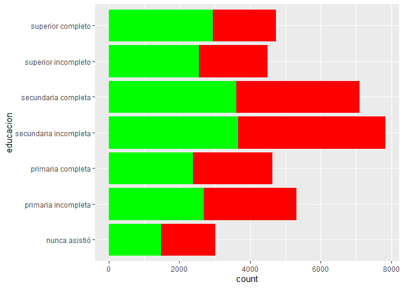<!-- -->

Si por el contrario se mapean las categorías de educación al color y las barras a sexo, se obtiene  


```r
ggplot(eph_2_20)+geom_bar(aes(sexo, fill=educacion))+
  coord_flip()
```

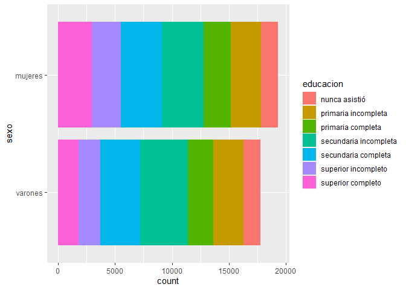<!-- -->

La elección maual de los colores requiere que se indiquen tantos como categorías tenga la variable, en este caso siete.  

Para conseguir que cada barra represente el 100% de la categoría, se indica en el argumento de geom_bar. En el caso del primer gráfico  

```r
ggplot(eph_2_20)+geom_bar(aes(educacion, fill=sexo), position = "fill")+
  scale_fill_manual(values=c("red", "green"))+
  guides(fill=FALSE)+coord_flip()
```

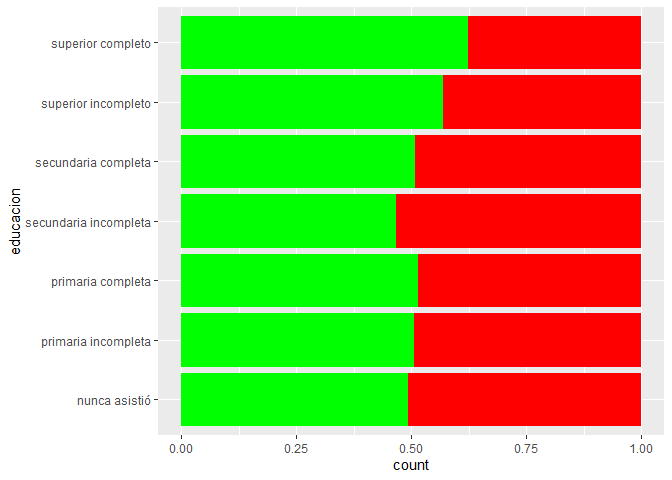<!-- -->

Y en el segundo  


```r
ggplot(eph_2_20)+geom_bar(aes(sexo, fill=educacion), position = "fill")+
  coord_flip()
```

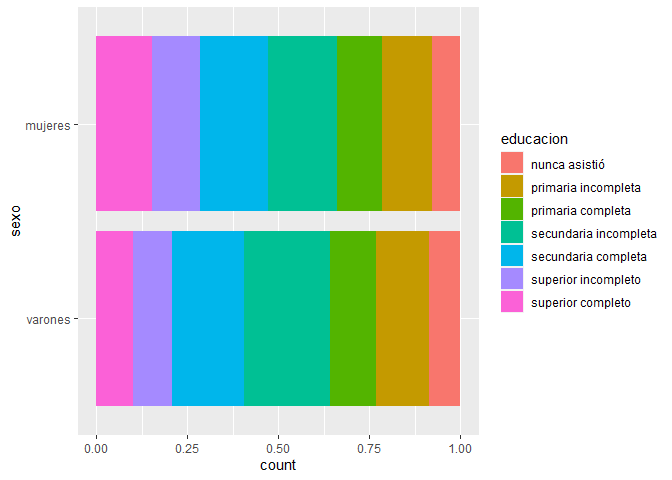<!-- -->

# Variables cuantitativas  

## Histograma  
Para representar variables continuas, como los ingresos, el gráfico descriptivo inicial es el histograma. Antes de hacerlo, vamos a quitar valores extremos que lo distorsionan, para ello solo retendremos aquellos casos que tengan ingresos por debajo del percentil 99  


```r
eph_2_20<-subset(eph_2_20, eph_2_20$ingresos<quantile(eph_2_20$ingresos, .99, na.rm = TRUE))
```


```r
ggplot(eph_2_20)+geom_histogram(aes(ingresos))
```

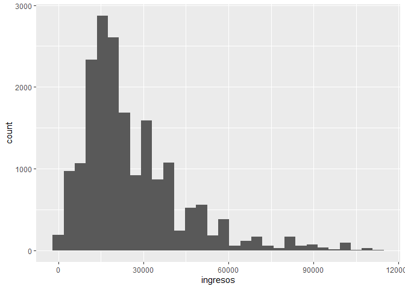<!-- -->

Que por defecto "corta" el campo de variación de la variable en 30 intervalos. Esto puede cambiarse, por ejemplo a veinte  

```r
ggplot(eph_2_20)+geom_histogram(aes(ingresos), bins = 20)
```

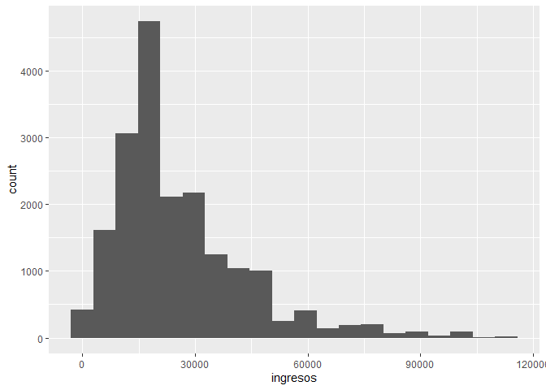<!-- -->

La variable sexo puede introducirse como color  

```r
ggplot(eph_2_20)+geom_histogram(aes(ingresos, fill=sexo))
```

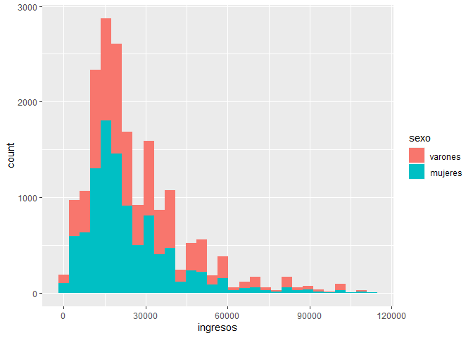<!-- -->

Para que el gráfico sea más claro, se los puede separar, con una capa más  


```r
ggplot(eph_2_20)+geom_histogram(aes(ingresos))+
  facet_grid(.~sexo)
```

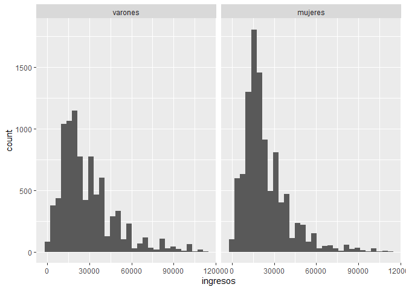<!-- -->

O verticalmente  

```r
ggplot(eph_2_20)+geom_histogram(aes(ingresos))+
  facet_grid(sexo~.)
```

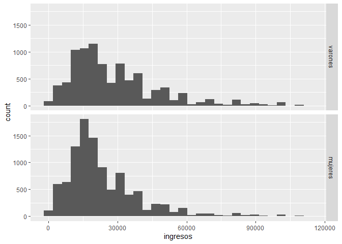<!-- -->

La capa *facet_grid* admite dos variables como argumento, separadas por *~*, las categorías de la primera definen las filas y las de la segunda, las columnas. Si solo se usa una, se ubica un punto en el lugar de la otra. 

Para comparar los ingresos por sexos y niveles de educación, se usan ambos criterios  


```r
ggplot(eph_2_20)+geom_histogram(aes(ingresos), bins=20)+
  facet_grid(educacion~sexo, scales = "free")
```

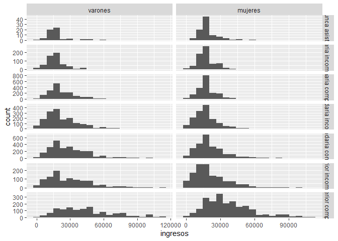<!-- -->


El paquete *ggthemes* contiene muchas plantillas para dar formato a los graficos. Se instala por única vez  


```r
install.packages("ggthemes")
```


Y se carga en la sesión  

```r
library(ggthemes)
```

Se puede simplificar el aspecto del gráfico anterior con el tema *tufte*  

```r
ggplot(eph_2_20)+geom_histogram(aes(ingresos, fill=educacion), bins=20)+
  facet_grid(educacion~sexo, scales = "free")+theme_tufte()+
  theme(axis.text.y=element_blank(), axis.ticks.y=element_blank(), strip.text.y = element_blank())+ylab("casos")
```

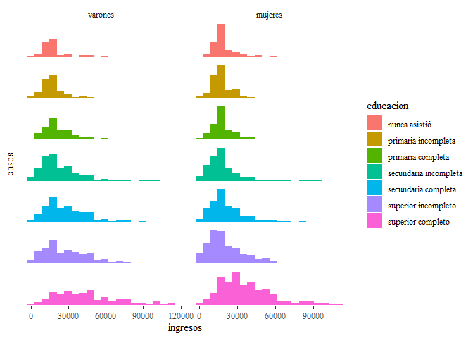<!-- -->

## Box plot  
La capa solo requiere la variable que se representa  

```r
ggplot(eph_2_20)+geom_boxplot(aes(ingresos))
```

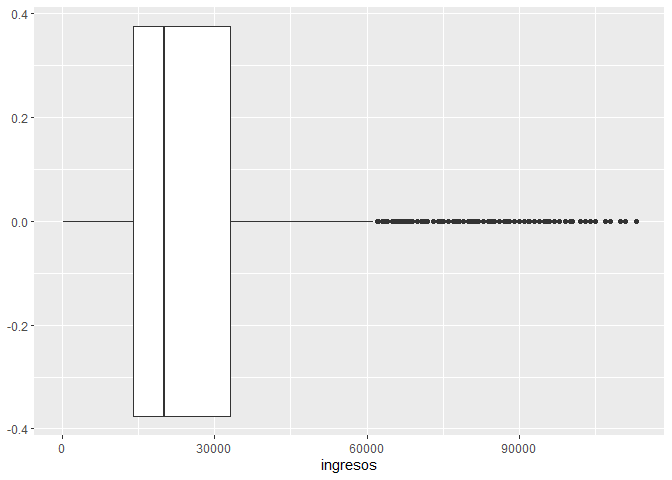<!-- -->

Por defecto se hace horizontal, pero se puede cambiar  


```r
ggplot(eph_2_20)+geom_boxplot(aes(y=ingresos))
```

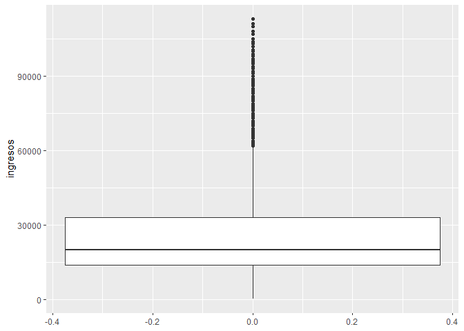<!-- -->


Cuando se agrega una variable categórica, la primera que se indica es tomada como *x* y va al eje horizontal  


```r
ggplot(eph_2_20)+geom_boxplot(aes(ingresos, sexo))
```

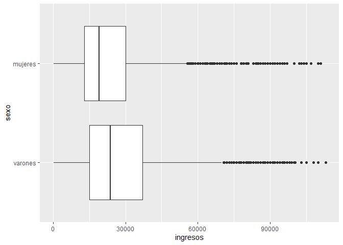<!-- -->

O bien  

```r
ggplot(eph_2_20)+geom_boxplot(aes(REGION, ingresos))
```

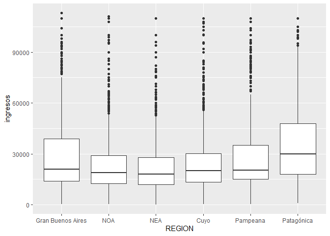<!-- -->

La visualización gana en claridad cuando la variable de clasificación tiene sus categorías ordenadas    


```r
ggplot(eph_2_20)+geom_boxplot(aes(ingresos, educacion))
```

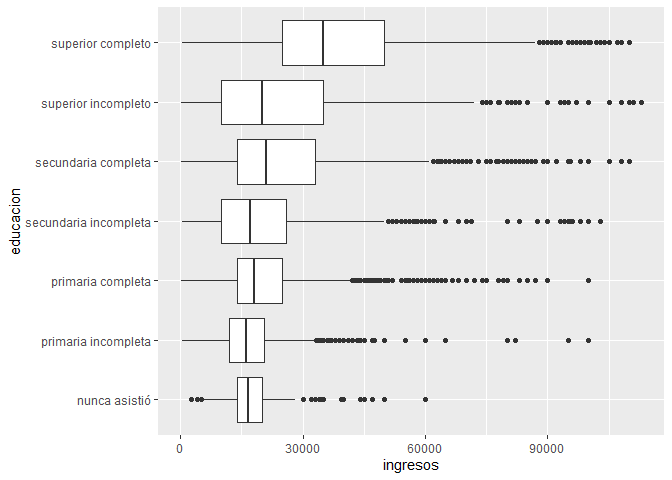<!-- -->

Los rótulos de los ejes pueden personalizarse  


```r
ggplot(eph_2_20)+geom_boxplot(aes(ingresos, educacion))+
  xlab("Ingresos totales individuales")+ylab("Máximo nivel de educación alcanzado")
```

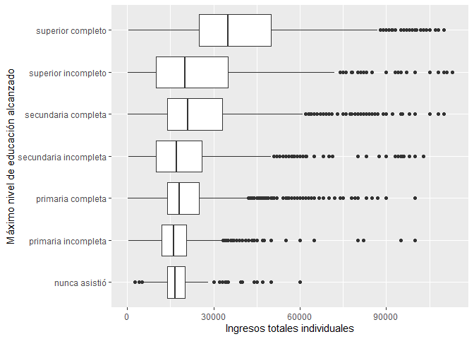<!-- -->

Además del box-plot clásico, se puede observar el perfil de la distribución de la variable cuantitativa para cada categoría de la otra, con el *gráfico de violín*, que es una versión estilizada del histograma, dibujado de manera reflejada  


```r
ggplot(eph_2_20)+geom_violin(aes(ingresos, educacion))
```

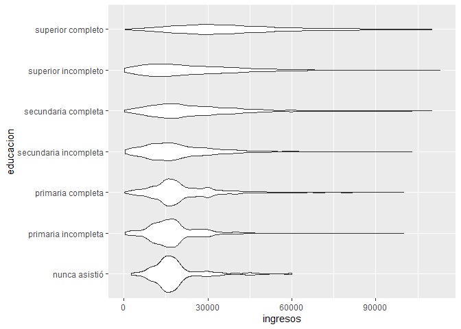<!-- -->

Coloreado y sin las leyendas, se obtiene  

```r
ggplot(eph_2_20)+geom_violin(aes(ingresos, educacion, fill=educacion))+
  guides(fill=FALSE)
```

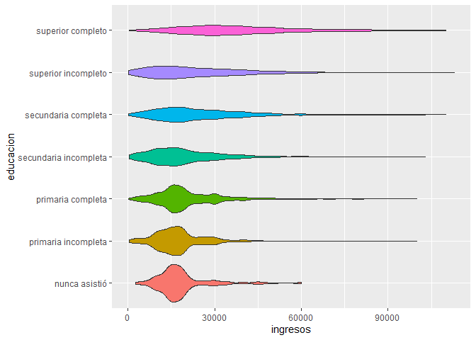<!-- -->

Si se cambia el tema al que usa el diario "The Economist"  

```r
ggplot(eph_2_20)+geom_violin(aes(ingresos, educacion, fill=educacion))+
  guides(fill=FALSE)+theme_economist()
```

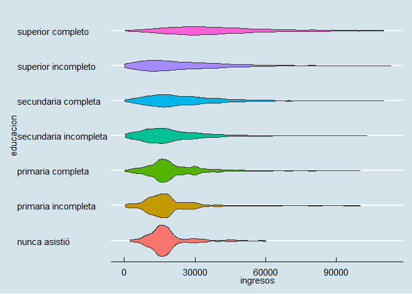<!-- -->

O el del Wall Street Journal

```r
ggplot(eph_2_20)+geom_violin(aes(ingresos, educacion, fill=educacion))+
  guides(fill=FALSE)+theme_wsj()
```

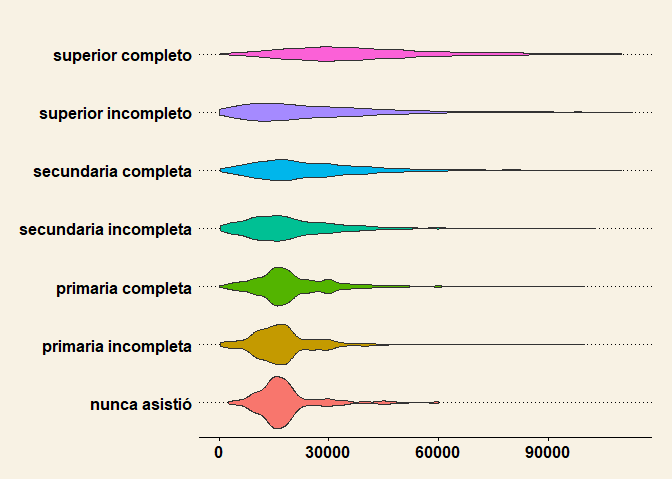<!-- -->


El título, subtítulo y referencia al pie ingresan como capa  


```r
ggplot(eph_2_20)+geom_violin(aes(ingresos, educacion, fill=educacion))+
  guides(fill=FALSE)+theme_tufte()+labs(title="Ingresos según nivel de Educación", subtitle = "Aglomerados urbanos de Argentina 2020", caption= "Fuente: INDEC, 2020")
```

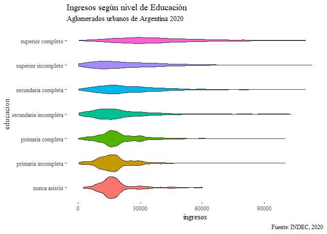<!-- -->


Para incorporar otra variable, el gráfico puede separarse por sexos  


```r
ggplot(eph_2_20)+geom_violin(aes(ingresos, educacion, fill=educacion))+
  guides(fill=FALSE)+theme_tufte()+labs(title="Ingresos según nivel de Educación y sexo", subtitle = "Aglomerados urbanos de Argentina 2020", caption= "Fuente: INDEC, 2020")+facet_grid(sexo~.)
```

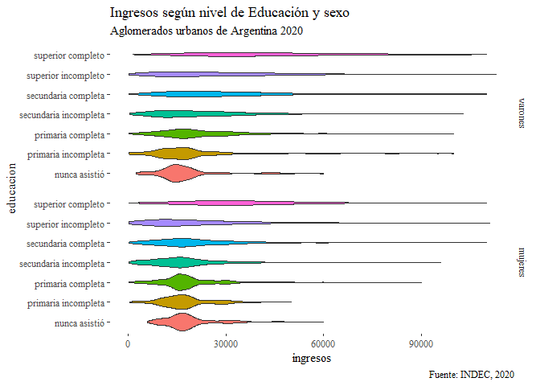<!-- -->

# Dos variables cuantitativas  

Debido a la la EPH tiene una alta variabilidad en los ingresos, los diagramas de dispersión no muestran tendencias claras. Por ejemplo, para observar la relación entre los ingresos presonales y la edad, limitada al intervalo de 15 a 64 años, el gráfico resultante es:  


```r
ggplot(subset(eph_2_20, eph_2_20$CH06>14 & eph_2_20$CH06<65), aes(x=CH06, y=ingresos))+geom_point()
```

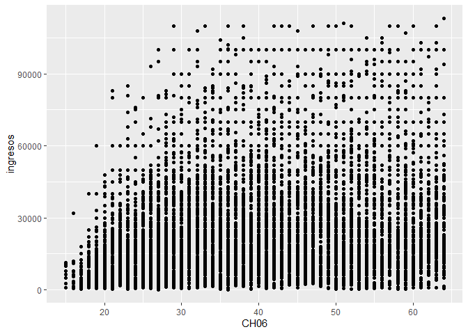<!-- -->

Puede agregarse una transparencia que muestre las zonas de mayor concentración de puntos  


```r
ggplot(subset(eph_2_20, eph_2_20$CH06>14 & eph_2_20$CH06<65), aes(x=CH06, y=ingresos))+geom_point(alpha=.3)
```

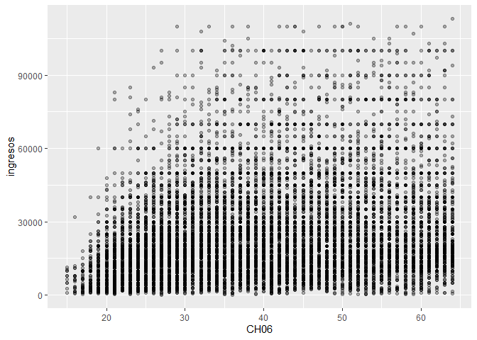<!-- -->

Pero aun así la distribución es poco clara. La línea de tendencia señala mejor el modo en que sucede la relación  


```r
ggplot(subset(eph_2_20, eph_2_20$CH06>14 & eph_2_20$CH06<65), aes(x=CH06, y=ingresos))+geom_point(alpha=.3)+geom_smooth()
```

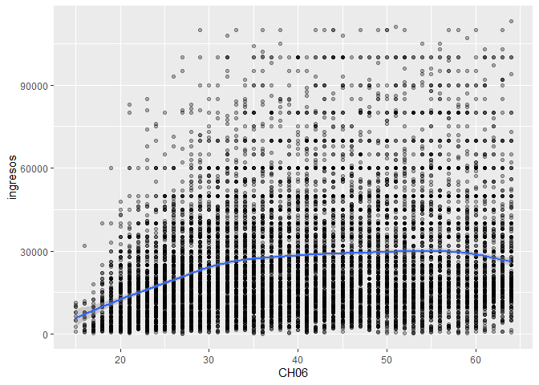<!-- -->

Para reducir el volumen de información, extraemos una muestra de 100 observaciones y construimos el diagrama de dispersión sobre ella (en el rango de edades de 15 a 64 años)  


```r
set.seed(13)
muestra_eph<-eph_2_20[sample(nrow(eph_2_20), 100), ]

ggplot(subset(muestra_eph, muestra_eph$CH06>14 & muestra_eph$CH06<65), aes(x=CH06, y=ingresos))+geom_point(alpha=.5)+geom_smooth()
```

<!-- -->
La banda alrededor de la línea de tendencia es el error, calculado localmente. Se la puede eliminar en el argumento de la capa de la línea  


```r
ggplot(subset(muestra_eph, muestra_eph$CH06>14 & muestra_eph$CH06<65), aes(x=CH06, y=ingresos))+geom_point(alpha=.5)+geom_smooth(se=FALSE)
```

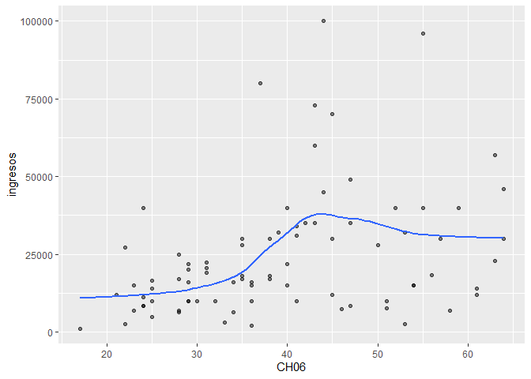<!-- -->
Ahora se puede mejorar el aspecto del gráfico  


```r
ggplot(subset(muestra_eph, muestra_eph$CH06>14 & muestra_eph$CH06<65), aes(x=CH06, y=ingresos))+geom_point(alpha=.5)+geom_smooth(se=FALSE)+
  labs(title = "Ingresos personales en función de la edad",
       subtitle = "Muestra de 100 casos de la EPH segundo trimestre 2020", caption = "Fuente: INDEC, 2020")+xlab("edad")+ylab("ingresos personales")+theme_tufte()
```

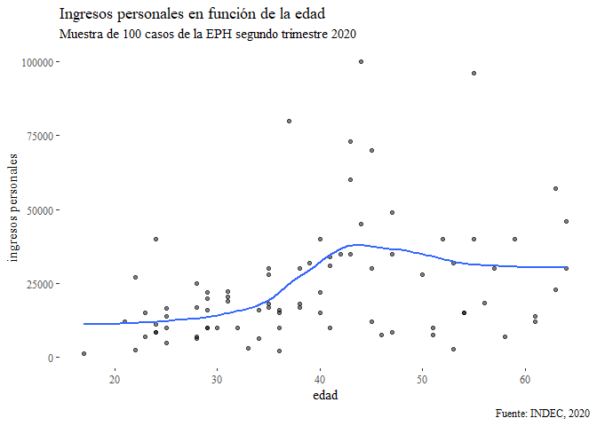<!-- -->
Si se limita la muestra solo a jefes y jefas de hogar y se separa por sexos, se obtiene  

```r
ggplot(subset(muestra_eph, muestra_eph$CH06>14 & muestra_eph$CH06<65 & muestra_eph$CH03==1), aes(x=CH06, y=ingresos))+geom_point(alpha=.5)+geom_smooth(se=FALSE)+
  labs(title = "Ingresos personales en función de la edad",
       subtitle = "Muestra de 100 casos de la EPH segundo trimestre 2020", caption = "Fuente: INDEC, 2020")+xlab("edad")+ylab("ingresos personales")+theme_tufte()+facet_grid(.~sexo)
```

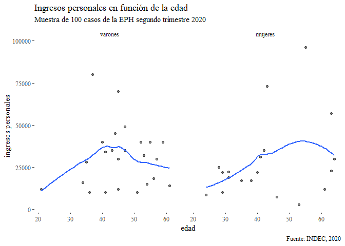<!-- -->
En lugar de "facetear", la separación por sexos se puede hacer con colores  


```r
ggplot(subset(muestra_eph, muestra_eph$CH06>14 & muestra_eph$CH06<65 & muestra_eph$CH03==1), aes(x=CH06, y=ingresos, col=sexo))+geom_point(alpha=.5)+geom_smooth(se=FALSE)+scale_color_manual(values=c("red", "green"))+
  labs(title = "Ingresos personales en función de la edad",
       subtitle = "Muestra de 100 casos de la EPH segundo trimestre 2020", caption = "Fuente: INDEC, 2020")+xlab("edad")+ylab("ingresos personales")+theme_tufte()
```

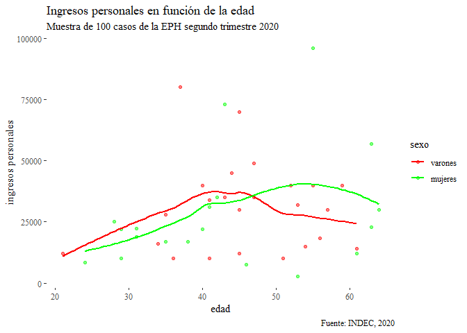<!-- -->

En este ejemplo, la instrucción *col=sexo* está en la capa base, por eso afecta tanto a *geom_point* como a *geom_smooth*. Para observar los efectos diferentes, mapeamos el sexo a la **forma** de cada punto y al **color** de la línea de tendencia.  


```r
ggplot(subset(muestra_eph, muestra_eph$CH06>14 & muestra_eph$CH06<65 & muestra_eph$CH03==1), aes(x=CH06, y=ingresos))+geom_point(aes(shape=sexo), alpha=.5)+geom_smooth(aes(col=sexo) , se=FALSE)+scale_color_manual(values=c("red", "green"))+
  labs(title = "Ingresos personales en función de la edad",
       subtitle = "Muestra de 100 casos de la EPH segundo trimestre 2020", caption = "Fuente: INDEC, 2020")+xlab("edad")+ylab("ingresos personales")+theme_tufte()
```

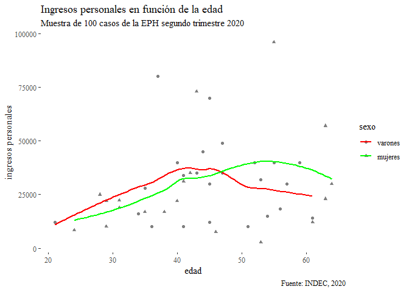<!-- -->

Acabamos de mapear una variable al color con el comando *col="nombre de la variable"*, dentro de la estética, sea de la capa base o de cada elemento geométrico que se agrega. Este comando es válido para los puntos y para la línea, por eso puede ir en la capa base. Sin embargo, en el histograma, esa misma intrucción se refiere al **borde** de los rectángulos y, para solicitar que los pinte de un color asociado a las categorías de la variable (que **rellene**), la instrucción, dentro de la estética es *fill="nombre de la variable"*. Puede parecer desconcertante, porque es el mismo efecto pero la instrucción es diferente.  
Esto tiene como  consecuencia que, cuando se van a elegir los colores manualmente, en el primer caso la capa sea *scale_color_manual()* y en el segundo *scale_fill_manual()*.  

## Ponderadores  
Para incluir los ponderadores que permiten la expansión desde la muestra a la población, en la estética (*aes*) de la capa base, se indica que los pesos están en la variable PONDERA.     


```r
ggplot(subset(muestra_eph, muestra_eph$CH06>14 & muestra_eph$CH06<65 & muestra_eph$CH03==1), aes(x=CH06, y=ingresos, weight=PONDERA))+geom_point(alpha=.5)+geom_smooth(se=FALSE)+
  labs(title = "Ingresos personales en función de la edad",
       subtitle = "Muestra de 100 casos de la EPH segundo trimestre 2020", caption = "Fuente: INDEC, 2020")+xlab("edad")+ylab("ingresos personales")+theme_tufte()+facet_grid(.~sexo)
```

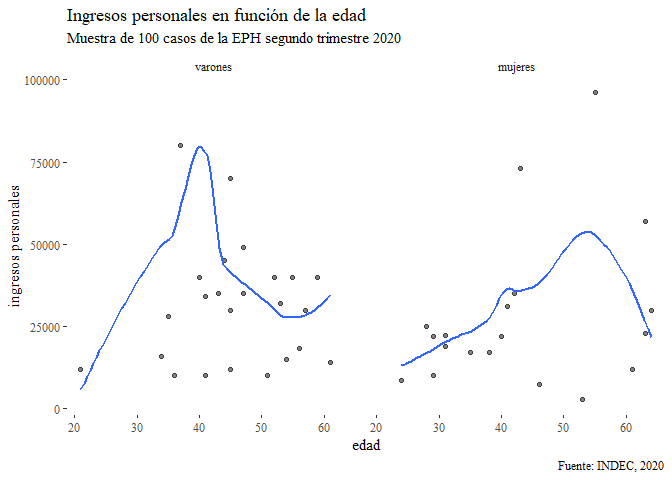<!-- -->

